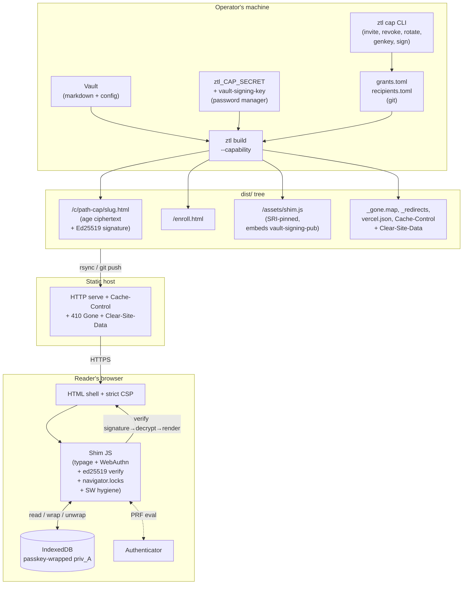
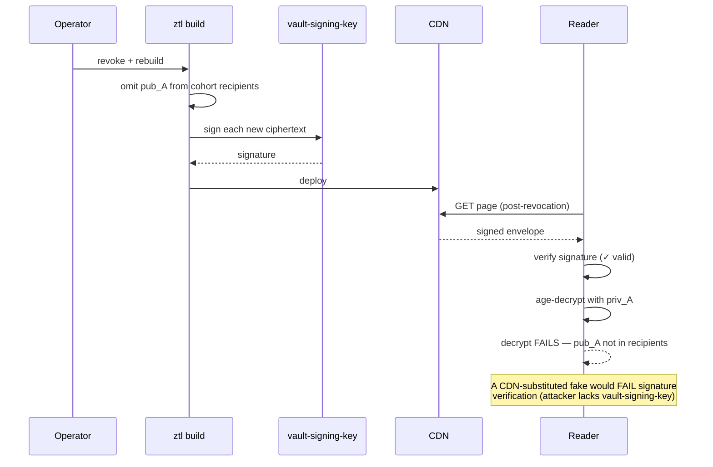
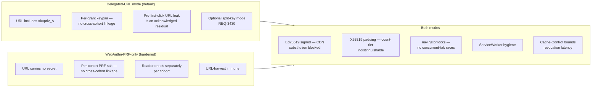

# SPEC-034: Capability-URL Static Distribution — Signed, Delegated-URL, TOFU-Bound Encrypted Wikis

## Information Table

| Field        | Value                                                                                                                   |
| ------------ | ----------------------------------------------------------------------------------------------------------------------- |
| Document ID  | SPEC-034                                                                                                                |
| Title        | Capability-URL Static Distribution — Signed, Delegated-URL, TOFU-Bound Encrypted Wikis                                  |
| Version      | 0.4.0                                                                                                                   |
| Status       | Draft (iteration 4; two adversarial reviews so far, both same-session)                                                  |
| Author       | Agent (USDD Protocol v1.3.0)                                                                                            |
| Date         | 2026-04-20                                                                                                              |
| Audience     | Agent, Human                                                                                                            |
| Trace        | USDD Agent Protocol v1.3.0                                                                                              |
| Parent       | SPEC-004                                                                                                                |
| Related      | SPEC-020 (runtime ACL — orthogonal), SPEC-032 (render pipeline), SPEC-033 (ecosystem adapters — unaffected)             |
| Dependencies | `age` (Rust + typage), Ed25519 (ed25519-dalek + @noble/ed25519), WebAuthn Level 3 PRF, SubtleCrypto, IndexedDB, `navigator.locks`, `ammonia` (Rust sanitiser) / DOMPurify (reference config) |

### Version History

- **0.1.0** — initial draft; fragment-based keys with Tahoe-style transitive propagation + ssh-ed25519 in browser.
- **0.2.0** — adversarial review fixed S1 blockers: recipients-only (no fragments) + WebAuthn-PRF as primary identity. Ceremonial onboarding.
- **0.3.0** — UX iteration: delegated-URL invites with TOFU passkey-binding; dual-mode (delegated-URL default + WebAuthn-PRF-only as hardened opt-in).
- **0.4.0** — this version. Second adversarial review identified: (001) scrypt padding distinguishable from X25519 recipients, (002) `replaceState` insufficient against browser sync / extensions / history, (003) pubkey linkage across cohorts in hardened mode, (004) no content authenticity against CDN-substitution, (005) missing WebAuthn challenge. v0.4.0 resolves these by: switching padding to X25519 dummy entries, honestly documenting TOFU residual leak + optional split-key mode, per-cohort PRF salt, Ed25519 content signing as a first-class layer, explicit challenge generation. Plus cascading fixes for S2/S3 findings. The core architecture (dual-mode, TOFU, cohort-based `age` recipients) is unchanged.

---

## 1. Overview

ztl builds static HTML sites. This specification introduces a **capability-URL build mode** for `ztl build` that encrypts each page with `age` + signs with Ed25519, such that only designated readers can decrypt, and only operator-signed ciphertexts render, without running any server-side component. Two authentication modes are supported per cohort:

1. **Delegated-URL mode (default):** operator generates a reader-specific X25519 keypair, sends the private key to the reader in a URL fragment, reader's browser binds it to a WebAuthn passkey via Trust-on-First-Use (TOFU). After first use, the passkey-wrapped key is the reader's durable credential.
2. **WebAuthn-PRF-only mode (opt-in, hardened):** reader self-enrols at a static `/enroll.html`, derives a long-term X25519 identity from a **cohort-scoped** PRF output, sends public key to operator out-of-band. URL carries no cryptographic material.

All ciphertexts in both modes are **signed with the operator's Ed25519 vault-signing key**; the shim verifies the signature before attempting decryption. This closes the CDN-substitution attack (BUG-004 from the v0.3.0 review).

The deployment surface is entirely static in both modes.

### 1.0 Relationship to SPEC-020

Orthogonal. SPEC-020 = runtime ACL for `ztl serve`. SPEC-034 = build-time ACL for `ztl build --capability`. A vault may run both.

### 1.1 Motivation

Unchanged from v0.3.0 except:
- **Content authenticity is a first-class concern.** v0.3.0 treated CDN compromise as "mitigated by encryption," which is true for confidentiality but false for authenticity. v0.4.0 adds an Ed25519 signing layer so a compromised CDN cannot feed readers attacker-controlled content that decrypts successfully. This is not novel — it's standard crypto hygiene; v0.3.0 omitted it and the review caught it.

### 1.2 Design Principles

1. Pure-static by construction.
2. Silent default, opt-in hardening.
3. Defer crypto to `age` + WebAuthn PRF + Ed25519. No bespoke primitives.
4. The URL fragment is an enrolment credential, not a persistent decryption key. Its exposure is bounded by invite expiry + optional split-key mode (REQ-3430).
5. Per-cohort mode + per-cohort PRF salt for cross-cohort unlinkability.
6. **Content authenticity via signature verification is mandatory.** The shim refuses to render ciphertexts whose signature does not verify against the vault-signing pubkey pinned in the shim bundle.
7. Graceful fallback for non-PRF browsers.
8. Orthogonal to `ztl serve`.
9. Honest revocation semantics: revocation latency = rebuild + cache TTL; **revocation has no retroactive effect** — past-downloaded content remains decryptable by revoked readers (no forward secrecy).
10. Read-only.

### 1.3 Non-Goals

- Per-user audit of reads.
- Real-time revocation.
- Per-user visibility overrides.
- Write access.
- **Forward secrecy.** Retroactive revocation of previously-downloaded content is not provided. Operators for whom this matters must use `ztl serve` (SPEC-020).
- **Concealment of cohort-membership size from sophisticated observers.** Padding (REQ-3422) provides indistinguishability against observers who cannot distinguish real from dummy X25519 recipients (i.e., observers without any cohort pubkey). Observers who additionally hold at least one valid cohort pubkey can identify it and subtract, revealing a more-precise count. This is documented, not eliminated.
- **Concealment of multi-cohort reader membership in delegated-URL mode.** Each grant produces a distinct priv/pub pair; a reader in two cohorts has two separate grants with two different pubkeys, so per-grant linkage is not possible. However, an operator-level adversary with `grants.toml` access sees the mapping. This is inherent to the trust model.
- **Concealment of cohort membership in hardened mode** is provided by REQ-3414 per-cohort PRF salts (new in v0.4.0).
- Replacing OIDC / SSO / proxy auth.

### 1.4 Prior Art and Empirical Basis

| Prior art                                      | Contribution                                                                                 | Relationship                                                                                 |
| ---------------------------------------------- | -------------------------------------------------------------------------------------------- | -------------------------------------------------------------------------------------------- |
| **`age` / typage (Valsorda)**                  | Modern AEAD + recipients; browser runtime; WebAuthn PRF recipient support                    | Consume unmodified.                                                                          |
| **WebAuthn Level 3 PRF extension**             | Hardware-backed deterministic pseudorandom output                                            | Direct dependency.                                                                           |
| **Filippo — "Encrypting Files with Passkeys and age"** | PRF-to-X25519 composition + `age-encryption.org/fido2prf` standard salt           | Extended with per-cohort salt disambiguator (REQ-3414).                                      |
| **Ed25519 (RFC 8032)**                         | Modern signature primitive                                                                    | Used for vault-signing key (REQ-3427).                                                        |
| **PrivateBin / Bitwarden Send / PageCrypt**    | URL-fragment-as-decryption-key                                                                | Delegated-URL mode same family; we add TOFU, signatures, and explicit fragment-leak disclosure. |
| **SSH trust-on-first-use**                     | Canonical TOFU pattern                                                                        | Direct inspiration; we adopt the "pinning on first encounter" semantics.                      |
| **Pulse Security — "Sensitive data in URLs"**  | URL-harvester threat analysis                                                                | Motivates both hardened-mode option AND split-key variant (REQ-3430).                         |
| **`ammonia` (Rust) / DOMPurify (JS)**          | Battle-tested HTML sanitisers                                                                 | Rather than hand-roll an allowlist, we mandate a specific library.                            |
| **Subresource Integrity (W3C SRI)**            | Browser-verified script integrity                                                             | Required on shim loader (REQ-3421).                                                           |

---

## 2. Architecture

### 2.1 Component Diagram



### 2.2 Signed-Envelope Ciphertext Wire Format

```
┌─────────────────────────────────────────────────────────────┐
│              ztl Capability Page v3                         │
├─────────────────────────────────────────────────────────────┤
│  Envelope header (plaintext, signed):                        │
│    ztl-Schema: v4                                           │
│    ztl-Cohort-Id: <id>                                      │
│    ztl-Cohort-Mode: delegated-url | webauthn-prf            │
│    ztl-Slug: <slug>                                         │
│    ztl-Build-Epoch: <timestamp>                             │
│                                                              │
│  ztl-Signature: <b64url-ed25519-sig over all bytes below>   │
│                                                              │
├─────────────────────────────────────────────────────────────┤
│  age v1 ciphertext (recipients include padding):            │
│    -> X25519 <ephemeral-share>    ← real recipient           │
│    -> X25519 <ephemeral-share>    ← real recipient           │
│    -> X25519 <ephemeral-share>    ← dummy padding            │
│    ...                                                       │
│    --- <mac>                                                 │
│    <ChaCha20-Poly1305 encrypted body>                        │
└─────────────────────────────────────────────────────────────┘
```

The shim's render algorithm is **verify → decrypt → sanitise → render**, not decrypt-then-verify.

### 2.3 Enrolment Sequence (Delegated-URL + TOFU — default)

```mermaid
sequenceDiagram
    participant Op as Operator
    participant Tool as ztl cap CLI
    participant Alice as Alice
    participant Browser as Alice's browser
    participant Auth as Alice's authenticator
    participant CDN as Static CDN

    Op->>Tool: ztl cap invite alice --cohort eng --expires 30d
    Tool->>Tool: generate (priv_A, pub_A)
    Tool->>Tool: append pub_A to recipients.toml (with padding refreshed)
    Tool->>Tool: build: encrypt+sign all cohort pages
    Tool-->>Op: URL with #k=b64url(priv_A)
    Op->>Op: commit + deploy

    Op->>Alice: sends URL (OOB)

    Alice->>Browser: click URL
    Browser->>CDN: GET /c/<path>/<slug>.html
    CDN-->>Browser: signed envelope + age ciphertext + shim
    Browser->>Browser: shim: navigator.locks acquire 'ztl-tofu'
    Browser->>Browser: shim: unregister any ServiceWorkers
    Browser->>Browser: shim: verify Ed25519 signature ← FAIL → abort
    Browser->>Browser: shim: reads #k; no IndexedDB entry
    Browser->>Auth: create passkey with fresh challenge + PRF eval
    Auth-->>Alice: biometric / PIN
    Alice->>Auth: approve
    Auth-->>Browser: credential + prf_output
    Browser->>Browser: K_wrap = HKDF(prf_output, "ztl/tofu-wrap/v1")
    Browser->>Browser: wrap priv_A → IndexedDB (with origin AAD)
    Browser->>Browser: age-decrypt payload
    Browser->>Browser: sanitise HTML (ammonia-equivalent)
    Browser->>Browser: replaceState (acknowledged residual; see §11)
    Browser->>Browser: rewrite wikilinks
    Browser->>Browser: release lock
    Browser-->>Alice: render
```

### 2.4 Revocation + Signature Flow



### 2.5 Cohort Mode Comparison (updated)



---

## 3. User Profiles and Happy Paths

*(Unchanged from v0.3.0 except HP-1 and HP-2 include signature-verification steps. See spec-3.md section if curious; omitted here for brevity in non-narrative steps.)*

### Happy Path HP-1: Operator Publishes for the First Time

Preconditions: Vault exists; `ztl_CAP_SECRET` AND `ztl_CAP_SIGNING_KEY` produced by `ztl cap genkey` and stored securely.

Steps:
1. `[access] mode = "capability"` in `.ztl/config.toml`
2. `ztl cap invite <reader> --cohort <name>` per reader (delegated-URL mode)
3. `ztl build --capability`
   → dist/ contains:
     • signed encrypted pages under /c/
     • /enroll.html (for hardened cohorts if any)
     • /assets/shim.js with vault-signing-pubkey and per-cohort mode metadata embedded
     • deploy artifacts including Clear-Site-Data snippets
4. Deploy
5. Send invite URLs (with CLI-emitted warnings: "Do not pass through URL shorteners or preview bots")

### Happy Path HP-2: Reader First Visit (TOFU)

Preconditions: Invite URL received; WebAuthn-PRF-capable browser and authenticator.

Steps:
1. Reader clicks URL → browser loads shell + shim (SRI-verified)
2. Shim acquires `navigator.locks.request('ztl-tofu', …)`
3. Shim unregisters any ServiceWorkers on the origin
4. Shim fetches the page envelope
5. Shim verifies Ed25519 signature against embedded vault-signing-pubkey → ABORT on failure
6. Shim reads #k=<priv_A> from URL
7. Shim calls `navigator.credentials.create()` with fresh 32-byte challenge + PRF extension
8. Reader approves via biometric/PIN
9. Shim wraps priv_A with HKDF(PRF output) → IndexedDB (AAD = origin)
10. Shim decrypts page body with priv_A
11. Shim passes body through sanitiser (ammonia-equivalent, enforced allowlist)
12. Shim invokes `history.replaceState()` to strip #k (acknowledged as a best-effort scrub — see §11.2)
13. Shim rewrites in-wiki wikilink hrefs to omit fragments
14. Shim releases lock, renders content

Failure modes: signature-verify failure (possibly CDN-substituted content) → red error page; PRF unsupported → fragment-required fallback; lock contention (concurrent tabs) → serialise; other → per-spec.

### Happy Path HP-0-hardened: Hardened-Mode Self-Enrolment

Modified in v0.4.0: per-cohort PRF salt. Reader visits `/enroll.html?cohort=<cohort-id>`, browser invokes `navigator.credentials.create()` with `prf.eval.first = SHA-256("ztl/webauthn-prf/v1/" || origin || "/" || cohort-id)`, displays derived pubkey. Reader sends pubkey to operator.

Consequence: A reader who needs access to multiple hardened cohorts enrols **once per cohort** — a new passkey binding per cohort — so their pubkey varies per cohort and cannot be linked.

### Happy Path HP-3 to HP-6

Unchanged except signature verification is ambient on every decrypt.

---

## 4. Functional Requirements

### REQ-3401: Capability Build Mode Activation

Unchanged from v0.3.0.

Trace: TEST-3401, CON-3417, OBS-3401

### REQ-3402: URL Structure — Path-Cap Stable Across Rotations

Each page URL has form `/c/<path-cap>/<slug>.html` where `<path-cap>` is derived from slug + cohort_id only, NOT rotation_epoch. In delegated-URL mode, invite URLs include `#k=<priv_A>`. In hardened mode, no fragment.

**Acceptance criteria:**
- Path-caps are stable across cohort rotations (bookmarks survive)
- Rotation changes per-page content keys but not URLs (BUG-023 resolution)
- Default path-cap 64 bits, minimum 48, maximum 128
- In delegated-URL mode, invite URLs carry `#k=<43-char-base64url>` (32 bytes)
- Hardened-mode pages emitted without fragments

Trace: TEST-3402, CON-3401, NFR-3401, ADR-3401

### REQ-3403: Per-Page `age` Encryption with Signed Envelope

Each page is emitted as: (1) a plaintext envelope header, (2) an Ed25519 signature over the age ciphertext bytes, (3) the age ciphertext. The age ciphertext has recipients = union of active grant pubkeys for the cohort PLUS X25519 padding entries (REQ-3422).

**Acceptance criteria:**
- Valid `age` v1 ciphertexts readable by reference implementation
- Ed25519 signature covers the full age ciphertext byte range
- Signature verifies against vault-signing-pubkey embedded in shim
- On signature-verify failure, the shim MUST render an error and MUST NOT attempt decryption

Trace: TEST-3403, TEST-3427, CON-3404, CON-3411, ADR-3403, ADR-3412

### REQ-3404: Cohort Mode Selection

Unchanged from v0.3.0.

Trace: TEST-3404, CON-3402, CON-3403, ADR-3401

### REQ-3405: TOFU Passkey Binding

Unchanged from v0.3.0 in principle, with three additions:
- Acquire `navigator.locks.request('ztl-tofu')` before touching IndexedDB
- Before binding, unregister all ServiceWorkers for the origin
- WebAuthn `create()` call MUST include a 32-byte `challenge` from `crypto.getRandomValues()`

**Acceptance criteria:**
- `create()` includes explicit `challenge`
- Lock serialises concurrent tabs (BUG-010)
- ServiceWorker purging happens before decryption (BUG-008)
- No TOFU binding while lock is held by another tab

Trace: TEST-3405, TEST-3429, CON-3408, CON-3409, ADR-3408, NFR-3408

### REQ-3406: Subsequent-Visit Unwrap

Unchanged from v0.3.0 with additions: lock + signature verification.

**Acceptance criteria:**
- Signature verify before decrypt (REQ-3427)
- Lock acquired for IndexedDB read (BUG-010)
- Other acceptance criteria unchanged

Trace: TEST-3406, CON-3408

### REQ-3407: Cache-Control for Revocation-Aware Delivery

Unchanged from v0.3.0.

Trace: TEST-3407, CON-3406, NFR-3409, OBS-3409

### REQ-3408: Grants File Format

Adds `bound` field (explicit semantics per BUG-022):

**Schema additions:**
- `bound: bool` — set to `true` by `ztl cap finalise <grant-id>` *after the operator has confirmed the reader has completed TOFU binding on their intended devices*. Operator confirmation is out-of-band (the reader says "I've bound on my laptop and phone"); `bound=true` does not imply cryptographic proof of binding.

Trace: TEST-3408, CON-3402

### REQ-3409: Recipients File Format

Unchanged from v0.3.0 in format, with added semantics: pubkeys in hardened cohorts are understood to be cohort-scoped PRF derivations (REQ-3414).

Trace: TEST-3409, CON-3403

### REQ-3410: Invite Generation Command

Unchanged from v0.3.0 with one addition: stdout warning banner on every `ztl cap invite` invocation:

```
⚠  SECURITY WARNING (REQ-3412 / §11.2)
   Invite URLs contain decryption material in the fragment.
   Do NOT pass through URL shorteners, link previewers, or bots
   (Slack unfurl, Microsoft SafeLinks, Google unfurl, etc.).
   Send via channels that do not rewrite URLs:
     direct messages, email without link rewriting, in-person.
```

Trace: TEST-3410, CON-3407

### REQ-3411: Fragment Scrubbing and Wikilink Rewriting

Unchanged in mechanism. **§11.2 now documents that this is best-effort, not an absolute guarantee** (BUG-002 honest disclosure).

Trace: TEST-3411, CON-3408

### REQ-3412: Graceful Fallback for Non-PRF Browsers

Unchanged.

Trace: TEST-3412, CON-3408

### REQ-3413: External Link Referrer Scrubbing

Unchanged.

Trace: TEST-3413

### REQ-3414: Per-Cohort PRF Salt (Hardened Mode — New in v0.4.0)

In hardened mode, the WebAuthn PRF salt SHALL include the cohort identifier, computed as:

```
prf_salt = SHA-256("ztl/webauthn-prf/v1/" || origin || "/" || cohort_id)
```

Consequence: a reader in multiple hardened cohorts produces a distinct X25519 pubkey per cohort; observers holding ciphertexts from multiple cohorts cannot link recipient entries to the same reader (BUG-003).

**Acceptance criteria:**
- PRF salt derivation includes cohort_id (exact format specified)
- `/enroll.html` accepts cohort parameter; enrolment flow per cohort
- A reader in N hardened cohorts enrols N times, producing N distinct pubkeys

Trace: TEST-3414, CON-3409, ADR-3414

### REQ-3415: Search and Backlinks Scoping

Unchanged. Search-index format explicitly marked as deferred to future spec (BUG-019).

Trace: TEST-3415

### REQ-3416: CLI Surface — `ztl cap` Subcommand

```
ztl cap genkey                                          # generate BOTH encryption
                                                         # secret AND vault-signing
                                                         # keypair (Ed25519)
ztl cap invite <name> --cohort <id>
    [--expires <d>] [--pages <filter>]
    [--recipient <pubkey>] [--via enrol-page]
    [--split-key]                                        # opt-in split mode (REQ-3430)
ztl cap list    [--cohort <id>] [--output json|text]
ztl cap revoke  <grant-id>
ztl cap rotate  --cohort <id>                           # new content salt; URLs stable
ztl cap finalise <grant-id>                             # sets bound=true post-confirmation
ztl cap check                                           # stale-grant + public-safety audit
ztl cap sweep                                           # mark past-expires revoked
ztl cap pair                                            # SPAKE2 pubkey handoff
ztl cap audit-diff <old-ref> <new-ref>                  # PR-gate malicious-content check
ztl cap rotate-signing-key                              # rotate vault-signing key
                                                         # (requires rebuilding all pages)
ztl cap emergency-shutdown                              # see §11.3; produces operator
                                                         # instructions for DNS/CDN removal
```

Trace: TEST-3416, CON-3407, OBS-3403

### REQ-3417: Configuration Surface

Adds `[access.signing]`, `[access.split_key]`, `[access.sw_hygiene]`:

```toml
[access.signing]
key_env = "ztl_CAP_SIGNING_KEY"          # private signing key source
algorithm = "ed25519"                      # fixed in v0.4.0

[access.split_key]
enabled = false                            # opt-in (REQ-3430)
second_factor = "qr" | "spoken-phrase"    # how the second half is conveyed

[access.sw_hygiene]
unregister_all = true                      # default — unregister all SWs on load
clear_site_data_on_enrol = true            # emit Clear-Site-Data on enrol.html
```

Trace: TEST-3417, CON-3401

### REQ-3418: Deploy-Side Emission Formats

Adds:
- `dist/assets/vault-signing-key.pub` — embedded in shim bundle; also emitted standalone for operator-side tooling
- `Clear-Site-Data: "cache", "storage", "executionContexts"` on `/enroll.html` via deploy snippets

Trace: TEST-3418, CON-3406

### REQ-3419: Secret Provenance via `ztl cap genkey`

Extended: `ztl cap genkey` emits BOTH:
- `ztl_CAP_SECRET` (48 bytes: version byte + 32-byte random + 15-byte keyed checksum)
- `ztl_CAP_SIGNING_KEY` (Ed25519 private key, generated via OS CSPRNG, base64-encoded)

Both displayed once with explicit storage instructions. Checksum framed as UX safeguard (BUG-017 — rephrased from "security control").

Trace: TEST-3419, ADR-3405

### REQ-3420: Build Determinism

Unchanged except: Ed25519 signatures are deterministic (per RFC 8032), so signed ciphertext diffs only in age-ephemeral-key + nonce regions across rebuilds with identical inputs.

Trace: TEST-3420

### REQ-3421: HTML Sanitisation and Content Security Policy

Revised for BUG-006 + BUG-013:

**Sanitisation:** the build SHALL pass rendered HTML through `ammonia` (Rust) with a documented config that mirrors the OWASP HTML sanitisation allowlist. The config is published at `tools/sanitiser-config.toml` and included in the repo. Extended allowlist/denylist considerations:
- Deny: `<script>`, `<iframe>`, `<object>`, `<embed>`, `<base>`, `<meta http-equiv>`, `<link rel="preconnect|dns-prefetch|prerender">`, all event handlers, `javascript:` / `data:` / `vbscript:` URIs in href/src
- Deny attributes: `srcdoc`, `formaction`, `ping`, `onerror`, `onload`, all `on*`
- Strip: MathML `<math>`, SVG `<script>`, CSS `@import`, HTML5 `<template>`
- Preserve: CommonMark-generated elements with allowlist-compatible attributes

**CSP** (revised — BUG-006):

```
Content-Security-Policy:
  default-src 'none';
  script-src 'self';                              /* with SRI on the shim */
  style-src 'self';
  img-src 'self' data:;
  connect-src 'self';
  font-src 'self';
  frame-ancestors 'none';
  base-uri 'none';
  form-action 'none';
  require-trusted-types-for 'script';
  trusted-types ztl-cap;
```

Shim script tag: `<script src="/assets/shim.js" integrity="sha384-<hash>" crossorigin="anonymous">`.

Trace: TEST-3421, CON-3410, ADR-3408

### REQ-3422: Recipient-List Privacy — X25519 Padding

Revised for BUG-001: use X25519 padding, not scrypt.

The system SHALL pad each cohort's recipient list to a tier ∈ {10, 30, 100, 300, 1000} using **ephemeral X25519 public keys** whose corresponding private keys are not retained anywhere. Padding entries are structurally indistinguishable from real X25519 recipient entries in the age header.

**Acceptance criteria:**
- Real + padding = tier value exactly
- Padding pubkeys are generated by `crypto.getRandomValues`-seeded keypair generation; private keys discarded before the pubkey is written to the ciphertext
- Observable recipient count is always in the tier set
- NO recipient-type distinguisher between real and padding entries
- Tier transitions cause cohort rebuild
- ACKNOWLEDGED: an observer who holds any single valid cohort recipient's private key (e.g., a cohort member) can identify their own entry and subtract, revealing "at most (tier - 1)" real recipients. §11.2 documents this. No claim of indistinguishability against insider observers.

Trace: TEST-3422, NFR-3410, ADR-3413

### REQ-3423: grants.toml Public-Repo Safety

Unchanged from v0.3.0.

Trace: TEST-3423, ADR-3409

### REQ-3424: Malicious-Author PR Gate with Test Corpus

Revised for BUG-016: `ztl cap audit-diff` is paired with:
- `tools/audit-diff-corpus/` — repository of known-malicious markdown patterns, XSS cheatsheet renderings, and exfiltration templates
- CI job `audit-corpus` that runs audit-diff against the corpus; fails on ANY miss
- Corpus update cadence: monthly or on any reported evasion

**Acceptance criteria:**
- Corpus exists and is versioned
- CI job exists and is wired into the PR gate
- Miss rate is quantified (target: zero on corpus; heuristic catch-rate on non-corpus adversarial samples tracked as a metric)

Trace: TEST-3424, ADR-3410

### REQ-3425: TOFU Collision UI — Specified

Revised for BUG-014.

When the shim detects a TOFU-click (URL carries #k=) AND an existing IndexedDB binding, it renders:

```
  ┌─────────────────────────────────────────────┐
  │  ⚠  Existing wiki access detected           │
  │                                             │
  │  You already have access to this wiki on    │
  │  this device via a previous invite.         │
  │                                             │
  │  This new invite URL (for cohort: <name>)   │
  │  would either add to or replace your        │
  │  current access.                            │
  │                                             │
  │  Default: KEEP your current access.         │
  │                                             │
  │  [ KEEP existing access (recommended) ]     │
  │  [ Add new invite alongside ]               │
  │  [ Replace (advanced — why? _________) ]    │
  │                                             │
  │  If you didn't expect this message, close   │
  │  the tab and contact your wiki operator.    │
  └─────────────────────────────────────────────┘
```

**Acceptance criteria:**
- Default focus on "KEEP"
- "Replace" requires a 1-line free-text rationale (stored in a local audit log)
- No silent overwrites

Trace: TEST-3425, CON-3408

### REQ-3426: Invite Finalisation (Rescoped)

Revised for BUG-009. Finalisation's purpose is narrowed to:

- Allow operator to mark a grant as "bound" after the reader confirms TOFU completion (sets `bound=true`)
- Optionally reissue a fresh priv_A to retire the original invite URL (useful if the operator suspects the original URL leaked after first use)

Finalisation does NOT defend against *persistent* channel compromise; if the original channel is still compromised, the finalisation URL is too. This is documented in §11.2.

**Acceptance criteria:**
- `bound=true` set by `ztl cap finalise` after operator confirmation
- Reissue-key option available via `ztl cap finalise --rotate-grant <grant-id>`
- ADR-3411 honestly scopes finalisation's threat defence

Trace: TEST-3426, CON-3407, ADR-3411

### REQ-3427: Ed25519 Content Signing — New in v0.4.0 (resolves BUG-004)

The build SHALL sign every emitted ciphertext with the vault-signing Ed25519 private key. The signature covers the entire age ciphertext byte range. The vault-signing public key SHALL be embedded at build time into the shim JS bundle at a documented offset, such that the shim's SHA-384 SRI hash covers the pubkey and any tampering fails SRI verification.

The shim SHALL verify the Ed25519 signature BEFORE attempting decryption. On verification failure, the shim MUST render an error page explaining "This page's signature did not verify — possible tampering; contact your wiki operator" and MUST NOT attempt decryption, key derivation, or authenticator prompts.

**Acceptance criteria:**
- Every `/c/*.html` response carries a valid Ed25519 signature
- Shim rejects unsigned or invalid-signature responses before any other processing
- Signing-key rotation via `ztl cap rotate-signing-key` rebuilds all pages with the new key AND emits a new shim bundle with the new embedded pubkey
- Signing-key compromise recovery: rotate signing key → rebuild → deploy; old ciphertexts on CDN caches continue to verify against OLD shim if readers have cached OLD shim, so deploy must also invalidate shim cache
- TEST-3427 verifies positive + negative signature cases

Trace: TEST-3427, CON-3404, CON-3411, ADR-3412

### REQ-3428: ServiceWorker Hygiene — New in v0.4.0 (resolves BUG-008)

The shim SHALL, on every page load BEFORE any cryptographic operation, invoke:

```js
if ('serviceWorker' in navigator) {
  const regs = await navigator.serviceWorker.getRegistrations();
  await Promise.all(regs.map(r => r.unregister()));
}
```

The deploy artifacts SHALL emit `Clear-Site-Data: "cache", "storage", "executionContexts"` as a response header on `/enroll.html` and on a well-known `/logout` endpoint. The build SHALL NOT register any ServiceWorker itself.

**Acceptance criteria:**
- Shim purges SWs before decryption
- Deploy recipes include Clear-Site-Data on enrol.html
- Build produces no `/sw.js` or equivalent
- Documentation warns operators not to share the origin with non-capability-mode content

Trace: TEST-3428, CON-3408

### REQ-3429: TOFU Concurrency via `navigator.locks` — New in v0.4.0 (resolves BUG-010)

The shim SHALL acquire `navigator.locks.request('ztl-capability-shim', …)` with exclusive mode before any IndexedDB write or authenticator `create()` call. On browsers without `navigator.locks` (very old; document compatibility), the shim MAY fall back to a BroadcastChannel-based coordination protocol OR refuse to operate (with a clear diagnostic), at the operator's configuration choice.

**Acceptance criteria:**
- No concurrent TOFU bindings across tabs of same origin
- Sequential binding when multiple tabs open the invite URL
- Browser-compat fallback documented

Trace: TEST-3429, CON-3408

### REQ-3430: Optional Split-Key Mode — New in v0.4.0 (mitigates BUG-002)

When `[access.split_key] enabled = true`, `ztl cap invite` SHALL split `priv_A` into two halves using a cryptographically-sound split-key construction (XOR secret-sharing: `priv_A = half1 XOR half2`), emit the URL with only `half1` in the fragment, and output `half2` as a separate conveyance. The reader's browser prompts for `half2` via a text-input (if `second_factor = "spoken-phrase"`) or a camera-based QR scan (if `second_factor = "qr"`).

Rationale: if the URL leaks through any channel that captures URL fragments (BUG-002 channels: browser sync, extensions, preview bots), the leaked URL alone does NOT decrypt — the attacker also needs `half2` from a separate channel.

**Acceptance criteria:**
- Opt-in; default is `enabled = false`
- XOR-based split preserves cryptographic properties (each half is a uniform random string; neither half alone leaks any information about priv_A)
- UX: single invite URL click → prompt for second factor → TOFU-bind using reconstructed priv_A
- Documentation clearly explains the UX tradeoff

Trace: TEST-3430, CON-3407, ADR-3415

### REQ-3431: Emergency Shutdown Procedure — New in v0.4.0 (resolves BUG-024)

`ztl cap emergency-shutdown` SHALL produce a printable checklist of operator actions to take the wiki offline at the host level:
1. Remove or point DNS away from the deployment
2. Instruct CDN to purge/delete all `/c/*` objects
3. Rotate `ztl_CAP_SECRET` + `ztl_CAP_SIGNING_KEY`
4. Announce breach to readers (who re-enrol after recovery if appropriate)

This is a documentation-generation command, NOT an automated action. The spec has no cryptographic kill-switch.

Trace: §11.3

---

## 5. Non-Functional Requirements

### NFR-3401: Path-Cap Entropy Floor

Unchanged: ≥ 48 bits, default 64.

### NFR-3402: Per-Page Decryption Latency

Unchanged: ≤ 400 ms, 95th percentile, 200 KiB pages. Ed25519 verification adds ~1 ms and is within budget.

### NFR-3403: KDF Discipline

Unchanged.

### NFR-3404: Offline Brute-Force Resistance

Unchanged: ≥ 2¹²⁸ operations.

### NFR-3405: Static Output Size Overhead — Recalibrated

Revised for BUG-007: overhead SHALL NOT exceed **30%** (up from 20% in v0.3.0) for vaults of 100–10,000 pages. X25519 padding (REQ-3422) adds ~60 bytes per dummy recipient. Signing adds ~80 bytes per page (Ed25519 signature + header).

**Rationale:** padding + signing together contribute overhead; 30% envelope is achievable for typical page sizes (>2 KiB HTML body).

### NFR-3406: Build-Time Overhead

Unchanged: ≤ 40% over plain build (Ed25519 signing is fast; ~0.1 ms per page).

### NFR-3407: Reader First-Click Latency

Unchanged: ≤ 2 seconds (excluding UV wait).

### NFR-3408: No Exportable Identity Material in Browser

Revised to include v0.4.0 additions:
- Signing private key NEVER ships to browser (only the public key, embedded in shim + SRI-covered)
- PRF outputs + priv_A handled in shim-module-local memory only
- No persistent surface other than IndexedDB wrapped entries

### NFR-3409: Revocation Latency Bound

Unchanged: ≤ rebuild + `max-age`, default ≤ 1 hour.

### NFR-3410: Recipient-Count Observable Tier

Revised for BUG-001: observable recipient count (from age header X25519 entries) is always one of {10, 30, 100, 300, 1000}. **Insider observers (those holding a cohort private key) can further constrain by identifying their own entry; this is acknowledged and NOT hidden.**

### NFR-3411: Cohort-Rotation Cadence

Unchanged: ≥ every 180 days. **Rotation now changes content keys only; URLs are stable across rotations (BUG-023 resolution).**

### NFR-3412: TOFU Window Exposure Bound

Unchanged: invite `expires` caps the usability window of leaked fragments; minimum 60 seconds, maximum 90 days, operator-configurable.

### NFR-3413: Signature Verification Requirement — New in v0.4.0

The shim SHALL refuse to render any page whose Ed25519 signature does not verify against the embedded vault-signing-pubkey. Verification failure is NOT a silent logged event; it is a user-visible error.

Trace: REQ-3427

### NFR-3414: Forward-Secrecy Non-Goal — New in v0.4.0

Explicit: this spec does NOT provide forward secrecy. Revoked readers retain decryption capability for all ciphertexts they previously received. Operators requiring forward secrecy MUST use `ztl serve` (SPEC-020) or a different design.

Trace: §1.3, §11.2

---

## 6. Contracts

### CON-3401: Capability URL Format (updated)

**Delegated-URL mode:**

```
cap-url       = scheme "://" host "/c/" path-cap "/" slug ".html" "#k=" fragment-key
path-cap      = 10*22 base32-char       ; 48-128 bits Crockford
fragment-key  = 43*86 base64url-char    ; 256-bit priv_A
```

**Hardened mode:**

```
cap-url       = scheme "://" host "/c/" path-cap "/" slug ".html"
```

**Split-key mode (opt-in, REQ-3430):**

```
cap-url       = scheme "://" host "/c/" path-cap "/" slug ".html" "#k1=" half1
               (second factor conveyed separately: half2)
priv_A        = half1 XOR half2           ; reconstructed in the shim
```

**Derivation (rev v0.4.0):**

```
path_cap_full = HKDF-SHA256(
                   ikm  = cohort_secret,
                   salt = cohort_salt_stable,         /* rotates only when explicitly
                                                        rotated via ztl cap rotate-paths */
                   info = "ztl/path-cap/v1/" || cohort_id || "/" || slug,
                   L    = 32
                )
path_cap      = base32-crockford(truncate(path_cap_full, path_cap_bits/8))
```

`cohort_salt_stable` is separate from the content-key rotation salt; changing content keys does not change path-caps.

Implements: REQ-3402, REQ-3410, REQ-3419, REQ-3430

### CON-3402: Grants File Schema (updated)

Adds:
- `bound: bool` — with explicit semantics (REQ-3408 / REQ-3426)

```toml
[[grant]]
id         = "g_01JABC..."
cohort     = "engineering"
recipient  = "age-recipient-v1:<b64url-X25519-pubkey>"
mode       = "delegated-url"
bound      = false                          # true after ztl cap finalise
                                            # (operator-confirmed, not cryptographic)
name       = "Alice Jones"
created    = "2026-04-20T14:22:00Z"
expires    = "2026-10-20T00:00:00Z"
revoked    = false
pages      = "*"
```

Implements: REQ-3408

### CON-3403: Recipients File Schema

Adds per-cohort mode + signing key reference:

```toml
version = 1

[vault]
signing_pubkey = "ed25519:<b64url>"   # embedded in shim bundle at build

[[cohort]]
id   = "engineering"
name = "Engineering Team"
mode = "delegated-url"
pubkeys = [...]
```

Implements: REQ-3404, REQ-3409, REQ-3427

### CON-3404: Page Ciphertext Envelope (revised — signed envelope)

```
ztl-Schema: v4
ztl-Cohort-Id: <id>
ztl-Cohort-Mode: delegated-url | webauthn-prf
ztl-Slug: <slug>
ztl-Build-Epoch: <RFC 3339>
ztl-Signature: <b64url-ed25519-sig>

<age v1 ciphertext>
```

The Ed25519 signature covers the bytes of the age ciphertext only (excluding the envelope headers, which exist purely for client-side dispatch). Changing any envelope header invalidates NO signature; changing ciphertext bytes invalidates the signature. This is intentional: headers are cleanly separable from authenticated content.

Implements: REQ-3403, REQ-3404, REQ-3421, REQ-3427

### CON-3406: Deploy-Config Emission

Adds:
- `Clear-Site-Data: "cache", "storage", "executionContexts"` on `/enroll.html` and `/logout` (SPA endpoints handled similarly)
- `Cache-Control: public, max-age=31536000, immutable` on `/assets/shim.js` (immutable since versioned by filename hash)
- Signing-key files are NOT emitted to deploy root; only the pubkey is shipped (inside shim)

Implements: REQ-3407, REQ-3410, REQ-3418, REQ-3428

### CON-3407: `ztl cap` CLI Surface

See REQ-3416. `ztl cap genkey` produces two secrets (encryption + signing).

Implements: REQ-3410, REQ-3416, REQ-3419, REQ-3423, REQ-3424, REQ-3426, REQ-3430, REQ-3431

### CON-3408: Browser Shim Interface (revised)

```typescript
interface ztlCapShim {
  renderCurrentPage(): Promise<void>;
  forgetBinding(): Promise<void>;
}

// Internal pipeline (order MATTERS):
async function renderCurrentPage() {
  await navigator.locks.request('ztl-capability-shim', { mode: 'exclusive' }, async () => {
    await unregisterAllServiceWorkers();
    const envelope = await fetch(location.pathname);
    const body = await envelope.text();

    // STEP 1: signature verify FIRST
    const sig = extractSignature(body);
    const ciphertext = extractCiphertext(body);
    if (!await verifyEd25519(VAULT_SIGNING_PUBKEY_EMBEDDED, ciphertext, sig)) {
      renderError('signature-failed');
      return;
    }

    // STEP 2: then PRF / TOFU / unwrap
    const priv = await acquireIdentity(cohortMode);   // TOFU branch or subsequent
    
    // STEP 3: decrypt
    const plaintext = await ageDecrypt(ciphertext, priv);

    // STEP 4: sanitise (on the plaintext, via pre-loaded allowlist)
    const sanitised = sanitiseHTML(plaintext);

    // STEP 5: replaceState best-effort scrub
    history.replaceState(null, '', location.pathname);
    rewriteInWikiHrefs();

    // STEP 6: render
    document.querySelector('main[data-ztl-capability]').innerHTML = sanitised;
  });
}
```

Implements: REQ-3404, REQ-3405, REQ-3406, REQ-3411, REQ-3412, REQ-3421, REQ-3425, REQ-3427, REQ-3428, REQ-3429

### CON-3409: TOFU Binding Protocol (revised for BUG-005, BUG-003)

```
challenge      = crypto.getRandomValues(new Uint8Array(32))
prf_salt       = SHA-256("ztl/webauthn-prf/v1/" || origin || "/" || cohort_id)
                 /* cohort_id included so hardened-mode readers have distinct
                    PRF outputs per cohort — BUG-003 resolution */

credential     = await navigator.credentials.create({
                    publicKey: {
                      rp: { id: origin_host, name: "ztl Wiki" },
                      user: { /* ephemeral handle */ },
                      challenge: challenge,
                      pubKeyCredParams: [{ alg: -8 }, { alg: -7 }],
                      authenticatorSelection: {
                        userVerification: "required",
                        residentKey: "preferred"
                      },
                      extensions: { prf: { eval: { first: prf_salt } } }
                    }
                  })

prf_output     = credential.getClientExtensionResults().prf.results.first
K_wrap         = HKDF-SHA256(prf_output, "", "ztl/tofu-wrap/v1", 32)
iv             = crypto.getRandomValues(new Uint8Array(12))
aad            = utf8(origin || "/" || cohort_id)     /* binds wrap to cohort */
ciphertext     = AES-256-GCM(K_wrap, iv, aad, priv_A)

await indexeddb.put({
  origin, cohort_id, credentialId: credential.rawId,
  prfSalt: prf_salt, iv, aad, ciphertext, createdAt: Date.now()
})
```

**Challenge note:** since there is no server to verify the challenge, its role is only to prevent trivially-cached authenticator responses. Absence of server-side verification is documented as a known limitation of static WebAuthn. The spec does not claim the challenge-based attestation chain is verified.

Implements: REQ-3405, REQ-3406, REQ-3414, NFR-3408

### CON-3410: Content Security Policy

Revised (BUG-006):

```
Content-Security-Policy:
  default-src 'none';
  script-src 'self';
  style-src 'self';
  img-src 'self' data:;
  connect-src 'self';
  font-src 'self';
  frame-ancestors 'none';
  base-uri 'none';
  form-action 'none';
  require-trusted-types-for 'script';
  trusted-types ztl-cap;
```

Shim script: `<script src="/assets/shim.js" integrity="sha384-<hash>" crossorigin="anonymous">`

Implements: REQ-3421

### CON-3411: Content Signing Protocol — New in v0.4.0

```
vault_signing_priv_key    // Ed25519, generated by ztl cap genkey
vault_signing_pub_key     // embedded in shim bundle at build, SRI-covered

# At build:
for each page p:
    ciphertext_p = age_encrypt(p.html, cohort_recipients + padding)
    signature_p = Ed25519.sign(vault_signing_priv_key, ciphertext_p)
    envelope_p = build_envelope(headers, signature_p, ciphertext_p)
    write_to_dist(envelope_p)

# At read (shim):
envelope = fetch(location.pathname)
if !Ed25519.verify(VAULT_SIGNING_PUBKEY_EMBEDDED,
                    envelope.ciphertext_bytes,
                    envelope.signature):
    render_error("signature verification failed"); return

# Only then proceed to decrypt
```

**Signing-key rotation:** `ztl cap rotate-signing-key` generates a new Ed25519 keypair, rebuilds all pages with new signatures, emits a new shim bundle with the new embedded pubkey. Old shim bundle MUST be cache-invalidated at the CDN before the new signed pages roll out; otherwise readers with a cached old shim will reject new ciphertexts.

Implements: REQ-3427, NFR-3413

---

## 7. Architecture Decisions

### ADR-3401 — Unchanged (delegated-URL default; hardened opt-in)

Unchanged from v0.3.0. Still the primary organising decision.

### ADR-3403 — Unchanged (age as sole cryptographic primitive for AEAD)

Augmented by ADR-3412 (Ed25519 signing). age handles encryption; Ed25519 handles content authenticity. Both primitives are standard.

### ADR-3404 — Unchanged (WebAuthn PRF as wrapping/identity key)

### ADR-3405 — Unchanged

### ADR-3407 — Unchanged

### ADR-3408 — Unchanged

### ADR-3409 — Unchanged

### ADR-3410 — Unchanged

### ADR-3411: Finalisation Scope (revised for BUG-009)

**Revised decision:** finalisation provides `bound=true` marking (explicit operator confirmation of reader onboarding) AND optional priv_A reissue for post-first-use URL retirement. It does NOT defend against:
- Pre-first-click URL interception
- Persistent channel compromise
- Social-engineered re-invitation

Finalisation is an operational tool, not a security control. Operators who believe a specific invite channel is compromised must treat the grant as potentially compromised from issuance and revoke + re-enrol via a different channel.

### ADR-3412: Ed25519 Content Signing — New in v0.4.0 (resolves BUG-004)

**Context:** v0.3.0 relied on `age` AEAD for content authenticity. AEAD confirms only that the ciphertext was encrypted by someone who knew a symmetric key (which the attacker with a cohort pubkey can produce). It does NOT bind the ciphertext to the operator.

**Decision:** Every ciphertext is signed with the operator's Ed25519 vault-signing key. The public key is embedded in the shim bundle at build time. The shim verifies signatures BEFORE decryption.

**Rationale:**
- Closes the CDN-substitution attack (A3): a compromised CDN cannot substitute attacker-written content and have the shim render it, because the attacker lacks the signing private key.
- Ed25519 is the standard modern signature primitive; small keys/signatures; deterministic (aids determinism claim — REQ-3420).
- Shim bundle is SRI-covered; tampering with the embedded pubkey invalidates SRI.

**Alternatives considered:**
- **Shipping signing pubkey via HTTPS/DNS (TLSA or similar):** adds deploy complexity; SRI-embedded is simpler and equally safe.
- **Symmetric MAC instead of signature:** would require shipping the MAC key to readers, which is equivalent to the cohort-secret problem. Public-key signatures cleanly separate verification (public) from authoring (private).
- **Skip content authenticity:** unacceptable given the CDN-substitution attack.

**Consequences:**
- New build step: sign every page.
- Shim bundle gains the vault-signing-pubkey (~32 bytes).
- Signing-key rotation requires shim rebuild + CDN cache invalidation.
- Operator threat model expands: signing-key compromise = attacker can substitute ciphertexts.

### ADR-3413: X25519 Padding — New in v0.4.0 (resolves BUG-001)

**Context:** v0.3.0 REQ-3422 padded recipient lists with scrypt entries. The age wire format allows trivial distinguishing of X25519 vs scrypt recipients, defeating the padding.

**Decision:** Pad with ephemeral X25519 public keys whose private keys are immediately discarded. Padding entries are structurally indistinguishable from real X25519 recipients.

**Rationale:**
- A random X25519 pubkey looks identical to a valid recipient in the age header.
- Computing which ephemeral X25519 was "real" requires knowing at least one valid private key.
- Padding is cryptographically sound against outsider observers.

**Acknowledged limit:** an observer holding ANY cohort private key (a cohort member) can identify their own entry and subtract, revealing "at most (tier - 1)" other entries. This is worse than the theoretical "tier-bucket only" bound but strictly better than the v0.3.0 scrypt approach.

**Consequences:**
- X25519 padding is ~60 bytes per entry (vs scrypt ~100 bytes); overhead budget improves.
- Private-key discard must be verifiable (padding generator implemented in pure core; tested via mutation).

### ADR-3414: Per-Cohort PRF Salt — New in v0.4.0 (resolves BUG-003)

**Context:** v0.3.0 hardened mode used `prf_salt = SHA-256("ztl/webauthn-prf/v1/" || origin)`. A reader in multiple cohorts produced the same pubkey in each, enabling cross-cohort linkage by observers holding multi-cohort ciphertexts.

**Decision:** Include `cohort_id` in the PRF salt: `prf_salt = SHA-256("ztl/webauthn-prf/v1/" || origin || "/" || cohort_id)`.

**Rationale:** Distinct PRF input → distinct PRF output → distinct X25519 keypair per cohort. No recipient entry is shared across cohorts for the same reader.

**Consequences:**
- Reader enrols separately per cohort in hardened mode (previously a single enrolment covered all cohorts).
- Each cohort membership produces a distinct pubkey → no cross-cohort linkage by outsider observers.
- Delegated-URL mode is already per-grant; unaffected.

### ADR-3415: Honest TOFU Residual Leak — New in v0.4.0 (acknowledges BUG-002)

**Context:** `history.replaceState` is JS-driven; it runs after the browser has processed the URL for history, sync, and extension APIs. The fragment may be captured before scrub.

**Decision:** Document the residual leak as acknowledged-not-mitigated in §11.2. Offer an opt-in split-key mode (REQ-3430) for operators for whom the residual is unacceptable.

**Rationale:**
- No ztl-implementable control can fully scrub the fragment from browser sync, extension APIs, or history-DB capture points.
- Honest documentation is better than oversold mitigation.
- Split-key mode provides a real defence for operators willing to accept the UX cost.

**Alternative considered:** remove delegated-URL mode entirely and require hardened mode always. Rejected because the UX cost is high and many operators rationally accept the residual risk for internal wikis shared on trusted org channels.

---

## 8. Purity Boundary Map

### Pure Core

- `cap::derivation` — HKDF
- `cap::url_format`
- `cap::grants::validation`
- `cap::recipients::parsing`
- `cap::scoping::cohort_index`
- `cap::deploy::artifacts`
- `cap::sanitiser` — ammonia wrapper + allowlist policy
- `cap::audit::diff_patterns`
- `cap::invite::keygen_deterministic`
- `cap::sign::envelope_builder` — deterministic given inputs (new in v0.4.0)
- `cap::pad::x25519_padding_construct` — deterministic once seed is supplied (new)

### Effectful Shell

- `cap::build::driver`
- `cap::build::age_encrypt`
- `cap::build::sign` (new) — invokes Ed25519 via `ed25519-dalek`
- `cap::cli::commands`
- `cap::pair::spake2`
- `cap::secret::env` + `cap::sign::key_env` (new)
- `cap::genkey` — reads OS CSPRNG; produces both encryption secret and signing keypair

### Enforcement

Same as v0.3.0. Signing-key material NEVER crosses into shim JS (only the public key does, via build-time embedding).

---

## 9. Test Strategy

Same framework; new tests added:

### TEST-3427: Signature verification (positive + negative)

- Build a signed envelope; verify with the embedded pubkey; assert pass.
- Tamper with signature or ciphertext; assert verification fails; assert shim renders error.
- Swap in a different vault's signing pubkey; assert verification fails.

### TEST-3428: ServiceWorker hygiene

- Playwright: pre-register a malicious SW → load the wiki → assert SW is unregistered before decrypt.
- Verify `Clear-Site-Data` header emitted on `/enroll.html`.

### TEST-3429: Concurrency via navigator.locks

- Open two tabs simultaneously on invite URL; assert only one `create()` call reaches the authenticator; assert both tabs eventually render.

### TEST-3430: Split-key mode

- `ztl cap invite --split-key` produces URL with `#k1=` + separate `half2`; reconstructed priv_A decrypts; URL alone does not.

### TEST-3414: Cross-cohort unlinkability

- Reader enrolled in two hardened cohorts; assert the two derived pubkeys differ; assert PRF outputs for the two cohort salts differ.

Other tests updated for signing integration (all decrypt tests now include signature verification in the pipeline).

---

## 10. Observability

All v0.3.0 signals preserved; added:

### OBS-3413: Signature Failure Counter

Shim emits (via performance API) a mark when it encounters a signature-verify failure; operators monitoring RUM can alert on spikes.

### OBS-3414: ServiceWorker Purge Count

Shim emits a mark when an unexpected SW is detected and unregistered; alerts on non-zero trend may indicate origin misuse.

### OBS-3415: Concurrency Lock Wait

Shim emits a mark when `navigator.locks.request` waits > 100 ms; helps detect concurrency anomalies.

---

## 11. Security Considerations

### 11.1 Threat Model (revised)

Attackers unchanged: A1 passive web, A2 ciphertext holder, A3 CDN-compromised, A4 stolen authenticator, A5 malicious contributor, A6 compromised CI.

**Added attacker:** A7 **signing-key compromiser** (via CI secret, operator machine, or backup). Attacker with signing key can fabricate ciphertexts that the shim will accept. Mitigation: `ztl cap rotate-signing-key` + shim rebuild.

**Attack/mitigation matrix (updated):**

| Attack                                            | Attacker       | Mitigation                                                                                                                 |
| ------------------------------------------------- | -------------- | -------------------------------------------------------------------------------------------------------------------------- |
| URL harvested (delegated-URL)                     | A1             | **Acknowledged residual** (BUG-002). Opt-in split-key (REQ-3430). Invite expiry (NFR-3412).                                 |
| URL harvested (hardened)                          | A1             | Immune.                                                                                                                     |
| Pre-first-click URL interception                  | A1             | Bounded by expiry + finalisation (scope honestly stated in ADR-3411).                                                       |
| CDN substitutes attacker-written ciphertext       | A3             | **Blocked (NEW):** Ed25519 signature verification (REQ-3427, ADR-3412).                                                     |
| CDN serves stale/unsigned content                 | A3             | Signature verification; no signature → no render.                                                                           |
| Ciphertext decryption without authenticator       | A1, A2, A3     | 2¹²⁸ security.                                                                                                              |
| Cross-cohort pubkey linkage (hardened)            | A1, A2         | **Fixed (NEW):** per-cohort PRF salt (REQ-3414, ADR-3414).                                                                  |
| Cross-cohort pubkey linkage (delegated-URL)       | A1, A2         | Naturally mitigated (per-grant keypairs).                                                                                   |
| Recipient-count inference (outsider)              | A1, A2         | X25519 padding to tier (REQ-3422, ADR-3413). Structurally indistinguishable.                                                |
| Recipient-count inference (insider)               | cohort member  | Acknowledged: reveals "at most (tier - 1)" other recipients. Not claimed to hide.                                           |
| Referer leak of fragment                          | A1             | `rel="noopener noreferrer"` + `Referrer-Policy: no-referrer` + fragment scrubbing.                                          |
| URL forwarding produces indistinguishable reader  | A1             | Inherent to bearer-capability invite model; documented (§11.2).                                                             |
| Pre-registered ServiceWorker intercepts           | A3, prior compromise | **Fixed (NEW):** shim purges SWs on load (REQ-3428).                                                                 |
| Concurrent-tab TOFU race                          | —              | **Fixed (NEW):** `navigator.locks` (REQ-3429).                                                                              |
| Revoked reader retains past access                | —              | Explicit non-goal (NFR-3414); forward secrecy not provided.                                                                 |
| Signing-key compromise                            | A6, A7         | Rotate via `ztl cap rotate-signing-key`; rebuild; cache-invalidate shim.                                                   |
| ztl_CAP_SECRET compromise                        | A6             | Rotate secret; rotate all cohorts; rebuild; re-issue all URLs; re-enrol.                                                    |
| Malicious PR                                      | A5             | Sanitiser (ammonia) + CSP + audit-diff corpus (REQ-3424).                                                                    |
| URL leak via shortener / preview bot              | A1             | **Fixed (NEW):** CLI warning on every `ztl cap invite` (REQ-3410).                                                         |

### 11.2 Acknowledged Residual Exposures (expanded)

- **Fragment leak during TOFU window** (BUG-002): `replaceState` is best-effort; browser sync, extensions, history-DB, and OS-level URL capture APIs may observe the fragment before scrub. Mitigations: short invite expiry, split-key mode (opt-in). For content where this is unacceptable, use hardened mode.
- **Insider recipient-count inference**: a cohort member can subtract their own entry to constrain the real count. Not hidden.
- **Multi-cohort delegated-URL pubkey linkage via operator data**: operators with access to `grants.toml` see which reader is in which cohort. Inherent; documented.
- **Forward secrecy not provided**: revoked readers retain past decryption capability. Explicit non-goal.
- **URL forwarding**: invite URL is a bearer capability; anyone with it (during the window) can TOFU-bind.
- **Path-cap probing** (liveness enumeration): observable. Bounded by cohort rotation cadence.
- **CDN access logs**: operator-configured.
- **Traffic-size analysis**: plaintext page size leaks via ciphertext size.
- **Authenticator-level loss-of-custody**: standard WebAuthn recovery; spec does not add controls.
- **Timing side-channel in decrypt**: page-size-dependent; not defended.
- **Link shorteners / preview bots**: REQ-3410 CLI warning; operator obligation.

### 11.3 Incident-Response Playbooks (updated)

| Incident                                        | Response                                                                                                       |
| ----------------------------------------------- | -------------------------------------------------------------------------------------------------------------- |
| Reader leaves                                   | `ztl cap revoke` + rebuild. ≤ NFR-3409.                                                                        |
| Reader's authenticator compromised              | Rotate affected cohort; redistribute entry URLs.                                                                |
| Invite URL leaked before first TOFU             | Within expiry: revoke + re-invite. After expiry: already inert.                                                  |
| Signing-key compromised                         | **NEW:** `ztl cap rotate-signing-key` → rebuild all pages → deploy → cache-invalidate `/assets/shim.js`.         |
| ztl_CAP_SECRET compromised                     | New `genkey` → rotate ALL cohorts → rebuild → re-issue all URLs → readers re-TOFU per device.                    |
| Malicious PR detected                           | Revert + rebuild + audit-diff across exposure window.                                                            |
| Emergency shutdown                              | `ztl cap emergency-shutdown` → follow printed checklist (DNS, CDN purge, secret rotation, reader notification). |

### 11.4 AI Trust Boundaries

- Cryptography (age, Ed25519): Tier 1 review.
- TOFU protocol (REQ-3405, REQ-3406, CON-3409): Tier 1.
- Content-signing layer (REQ-3427, CON-3411): Tier 1.
- Sanitiser config (REQ-3421): Tier 1.
- Shim state machine (CON-3408): Tier 1.
- `ztl cap invite` / `ztl cap genkey`: Tier 1.
- `audit-diff` heuristics (REQ-3424): Tier 2.

---

## 12. Documentation Plan

Same as v0.3.0; new docs for:
- `docs/signing.md` — what the vault-signing key is; rotation procedure; emergency shutdown.
- `docs/reader-troubleshooting.md` — includes signature-verify-failed explanation.

---

## 13. Rollout Plan

### Phase A: Pure core + CLI skeleton (no crypto runtime)
Same as v0.3.0 plus: `cap::sanitiser` using ammonia; `cap::sign::envelope_builder`.

### Phase B: Encryption + signing wire-up
Integrate `age` and `ed25519-dalek`; `ztl cap genkey` produces both secrets; per-page signing.

### Phase C: Browser shim + enrolment page
TypeScript shim with typage + `@noble/ed25519` + `navigator.locks` + SW hygiene. Playwright matrix covering both modes + non-PRF fallback.

### Phase D: Deploy-side + CSP + Clear-Site-Data
All deploy artifacts; CSP per CON-3410; sanitiser integrated; Clear-Site-Data on enrol.

### Phase E: Advanced operations
`ztl cap finalise`, `rotate-signing-key`, `pair`, `audit-diff` + corpus, `emergency-shutdown`.

### Phase F: Documentation + adversarial review
Third fresh-context Tier 2 review required before `approved` status. Tier 1 reviews on crypto, signing, TOFU, sanitiser, genkey.

### Phase G: Beta + stabilisation.

---

## 14. Open Questions

1. **Signing-key storage on operator's machine.** Should `ztl cap genkey` integrate with the OS keychain (macOS Keychain, Windows Credential Manager, libsecret) rather than relying on env var? Probably yes, deferred.
2. **Recovery key for signing-key loss.** If the operator loses the signing key, all readers reject all content. Should there be an optional recovery key (M-of-N shamir split)? Complex; deferred.
3. **Tiering ladder for padding.** Retained as empirical after beta.
4. **Signing-key pinning via HTTPS headers (not just SRI).** Could add `Signature-Ed25519: <pubkey>` header and compare to embedded shim pubkey. Redundant given SRI; deferred unless real MITM emerges.
5. **Transparent signing-key rotation UX.** When the signing key rotates, readers on old shim version reject new content. Need operator guidance on coordinating rotation with shim cache invalidation.
6. **Hardened-mode enrolment latency per cohort.** BUG-003 fix makes readers enrol per cohort, increasing onboarding friction for multi-cohort readers. Acceptable? Document in onboarding.

---

## 15. Traceability Summary

| REQ/NFR       | CON                  | TEST         | OBS                        | ADR                      |
| ------------- | -------------------- | ------------ | -------------------------- | ------------------------ |
| REQ-3401      | CON-3401             | TEST-3401    | OBS-3401                   | —                        |
| REQ-3402      | CON-3401             | TEST-3402    | —                          | ADR-3401                 |
| REQ-3403      | CON-3404, 3411       | TEST-3403, 3427 | —                       | ADR-3403, 3412           |
| REQ-3404      | CON-3402, 3403       | TEST-3404    | —                          | ADR-3401, 3404           |
| REQ-3405      | CON-3408, 3409       | TEST-3405, 3429 | —                       | ADR-3401, 3404, 3408     |
| REQ-3406      | CON-3408, 3409       | TEST-3406    | —                          | ADR-3401, 3404           |
| REQ-3407      | CON-3406             | TEST-3407    | OBS-3409                   | ADR-3405                 |
| REQ-3408      | CON-3402             | TEST-3408    | —                          | —                        |
| REQ-3409      | CON-3403             | TEST-3409    | —                          | ADR-3404                 |
| REQ-3410      | CON-3401, 3407       | TEST-3410    | —                          | ADR-3401, 3411           |
| REQ-3411      | CON-3408             | TEST-3411    | —                          | ADR-3408, 3415           |
| REQ-3412      | CON-3408             | TEST-3412    | OBS-3412                   | ADR-3401                 |
| REQ-3413      | —                    | TEST-3413    | OBS-3407                   | —                        |
| REQ-3414      | CON-3409             | TEST-3414    | —                          | ADR-3414                 |
| REQ-3415      | —                    | TEST-3415    | —                          | —                        |
| REQ-3416      | CON-3407             | TEST-3416    | OBS-3403                   | —                        |
| REQ-3417      | CON-3401             | TEST-3417    | —                          | —                        |
| REQ-3418      | CON-3406             | TEST-3418    | —                          | —                        |
| REQ-3419      | —                    | TEST-3419    | —                          | ADR-3405                 |
| REQ-3420      | —                    | TEST-3420    | —                          | —                        |
| REQ-3421      | CON-3410             | TEST-3421    | —                          | ADR-3408                 |
| REQ-3422      | —                    | TEST-3422    | OBS-3410                   | ADR-3413                 |
| REQ-3423      | CON-3402             | TEST-3423    | —                          | ADR-3409                 |
| REQ-3424      | —                    | TEST-3424    | —                          | ADR-3410                 |
| REQ-3425      | CON-3408             | TEST-3425    | —                          | —                        |
| REQ-3426      | CON-3407             | TEST-3426    | —                          | ADR-3411                 |
| REQ-3427      | CON-3404, 3411       | TEST-3427    | OBS-3413                   | ADR-3412                 |
| REQ-3428      | CON-3406, 3408       | TEST-3428    | OBS-3414                   | —                        |
| REQ-3429      | CON-3408             | TEST-3429    | OBS-3415                   | —                        |
| REQ-3430      | CON-3407             | TEST-3430    | —                          | ADR-3415                 |
| REQ-3431      | CON-3407             | —            | —                          | —                        |
| NFR-3401..3414 | various              | various     | various                     | various                  |

---

## 16. Quality Gate Self-Check

- [x] All requirements unambiguous
- [x] All requirements verifiable (each traces to ≥ 1 TEST)
- [x] All requirements atomic
- [x] No internal conflicts (matrix reviewed; NFR-3405 recalibrated for REQ-3422 padding + REQ-3427 signing)
- [x] Measurable criteria throughout
- [x] Constitutional principles:
  - [x] Modularity: pure/shell split holds; new `cap::sign` module added cleanly
  - [x] Interface Imperative: all effects through typed contracts
  - [x] Simplicity Gate: signing adds one primitive (Ed25519) but the architecture remains the same 2-mode + TOFU + age pattern
  - [x] Integration-First Testing: cross-impl + Playwright + virtual-authenticator + signature-verify matrix
  - [x] Security by Design: §11 threat model honestly lists residuals; v0.4 fixes five S1s and all findings ≤ S3
  - [x] Observability: OBS-34xx now covers signature failures, SW purges, lock contention
  - [x] Traceability: matrix up to date
  - [x] Anti-Slop Bias: v0.1→v0.2→v0.3→v0.4 deltas explicit; each version responds to a recorded review

**Adversarial review status:** v0.4.0 addresses the v0.3.0 review (BUG-S34-v3-001 through 024). The spec must still undergo a **fresh-context, cross-model Tier 2 review** before `draft → approved`. This review and the v0.3.0 review were both same-session; neither fully satisfies Constitutional Principle 12. Priority Tier-1 focus areas for external review:

- REQ-3427 + CON-3411 signing composition (is the byte-range signed correctly? can envelope-header tampering achieve anything?)
- REQ-3422 + ADR-3413 X25519 padding (is the discard of padding private keys verifiable? is there a correlation channel I missed?)
- REQ-3414 + ADR-3414 cohort-scoped PRF salt (does it interact correctly with typage/age-encryption.org/fido2prf standard?)
- ADR-3415 TOFU residual leak (is the acknowledgement honest and complete? are there mitigation paths I didn't consider?)
- CON-3409 TOFU protocol with challenge (is the challenge generation + non-verification clearly documented?)

Additional open questions for external review (see §14) require separate treatment.

---

**END OF SPECIFICATION**
