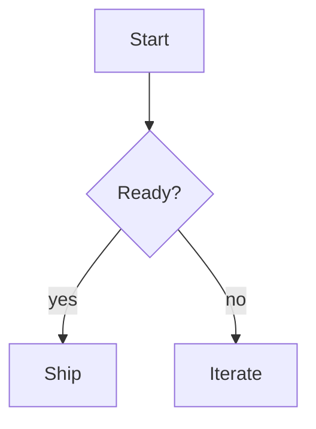

# mdbook-mermaid canary

Paragraph before the diagram — ensures the preprocessor leaves
surrounding prose unchanged.

```mermaid
graph TD;
  Start --> Decide{Ready?};
  Decide -->|yes| Ship;
  Decide -->|no| Iterate;
```

Paragraph after the diagram.
